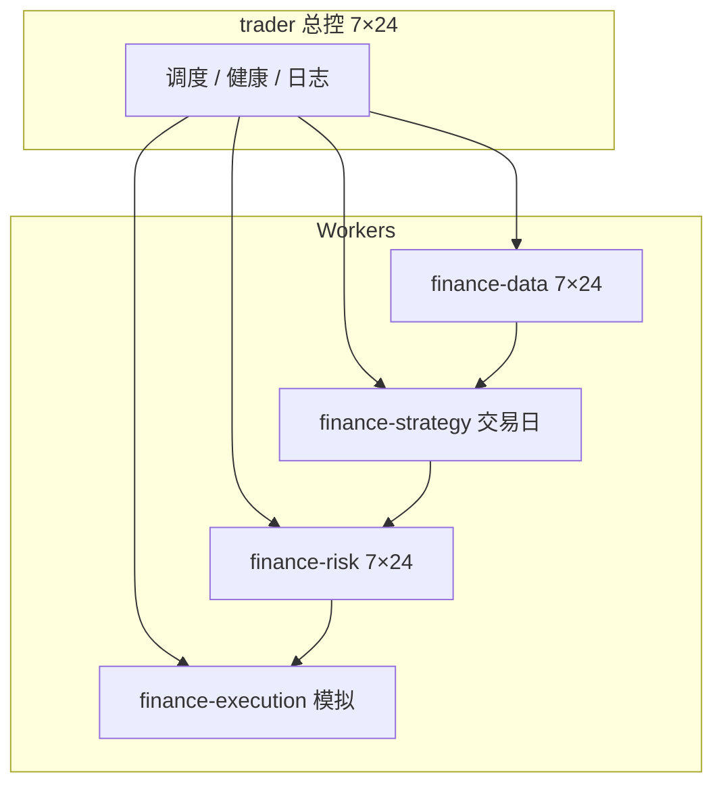

# 金融域架构 · 五层量化（A 股）

## 职责对照（你的设计）

| # | 组件 | Agent | 要点 |
|---|------|-------|------|
| 1 | Orchestrator | `trader` | 调度、Cron、异常兜底、`trader/logs/` |
| 2 | Data | `finance-data` | 东财妙想、L1/日/分摘要、基本面、财联社舆情；`cache/` |
| 3 | Strategy | `finance-strategy` | 科技强势+回调+二波；候选池、盘中预警、信号 JSON |
| 4 | Risk | `finance-risk` | 仓位/止损/集中度/黑天鹅；`trading_gate.json` |
| 5 | Execution | `finance-execution` | 仅模拟盘；滑点 ±0.3%；`orders/` + `log/` |

## 交易日 Cron 摘要

| 时间 | Agent |
|------|-------|
| 每小时 | data 刷新、trader 健康 |
| 每 2h | risk 刷新 gate |
| 08:50 / 09:25 / 15:35 | risk 盘前/合规/盘后 |
| 09:00 / 15:00 | strategy 投研 |
| 09:26 / 15:05 | execution 开/收盘 |
| 盘中 :00/:30 | strategy 预警 |
| 16:30 | strategy 候选池 |

详见 [`shared/A-SHARE-PLAYBOOK.md`](shared/A-SHARE-PLAYBOOK.md)。

## InfluxDB

当前本地 JSON 缓存；[`workers/data/timeseries/README.md`](workers/data/timeseries/README.md) 为 Phase 2。
